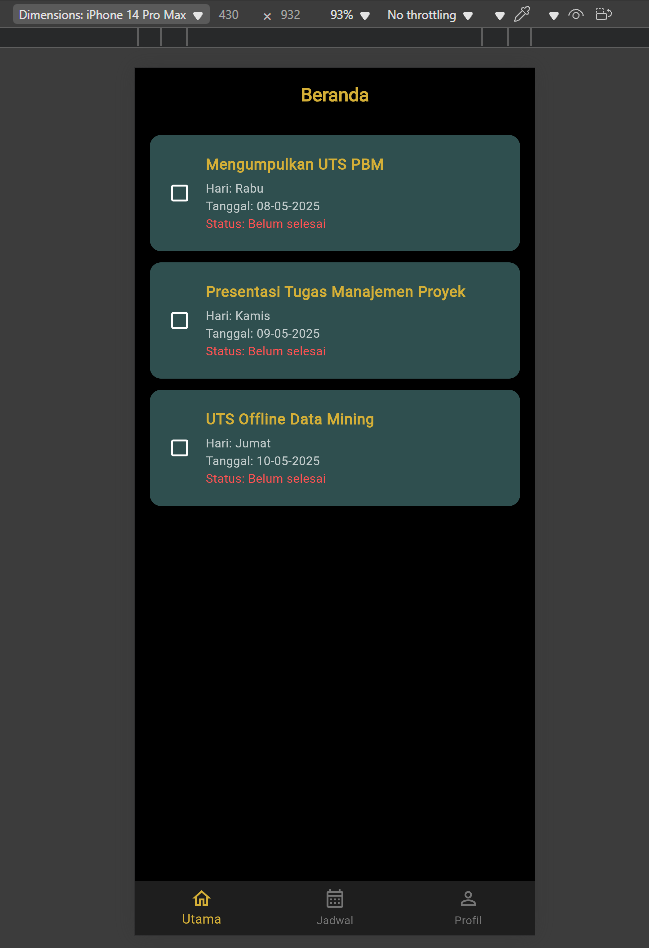
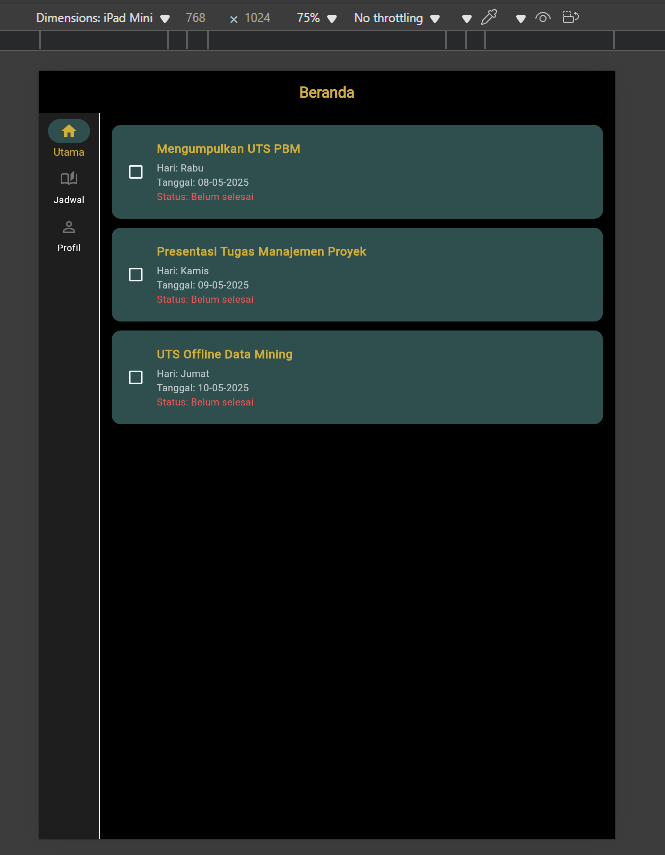
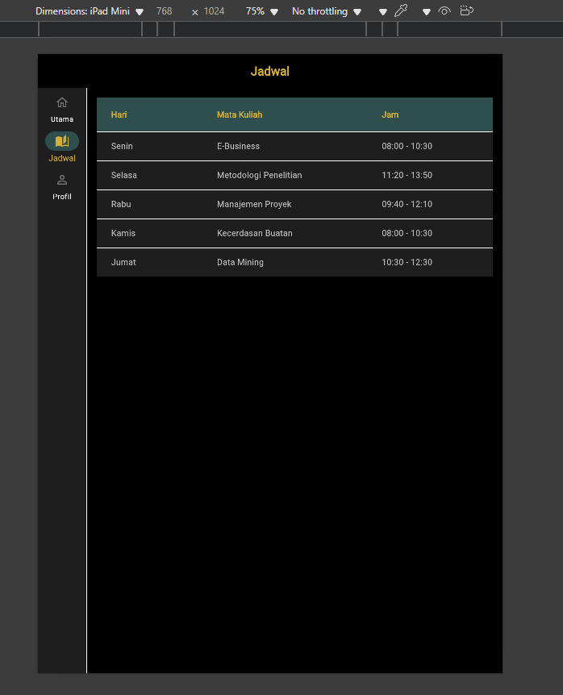
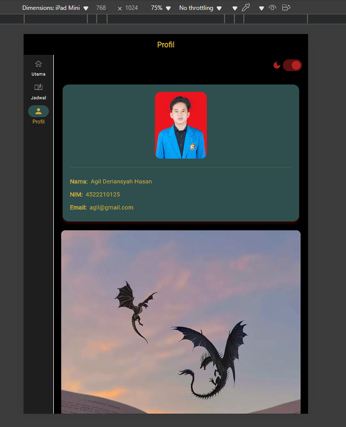
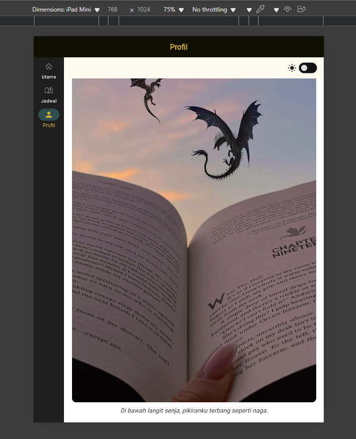

# 🌟 Ujian Tengah Semester 🌟

## 👥 Nama dan Npm
| Nama                  | NPM        |
|-----------------------|------------|
| Agil Deriansyah Hasan | 4522210125 |

---

## 🌐 Deskripsi Aplikasi

1. Layout Adaptif
    - Gunakan flutter_adaptive_scaffold ==> layout menyesuaikan dengan ukuran layar (mobile/tablet).
    - Gunakan Bottom Navigation Bar untuk tab (Home, Jadwal, dan Akun)
2. Halaman Home
    - Menampilkan daftar kegiatan mahasiswa dengan ListView
    - Setiap kegiatan memiliki nama, tanggal, dan checkbox untuk menandai “selesai”.
3. Halaman Jadwal Kuliah
    - Menampilkan jadwal perkuliahan seminggu ini dalam bentuk Card atau Table
4. Halaman Akun Profil
    - Menampilkan data pengguna (nama, NIM, email).
    - Terdapat switch/tombol untuk mengganti mode tema (light/dark) menggunakan setState.

## 📸 Hasil Screenshot

### Halaman Home untuk Mobile

### Halaman Home untuk IPad

### Halaman Jadwal Kuliah

### Halaman Profile

### Halaman Ciri Khas Aplikasi

## Link YouTube 

https://youtu.be/pMN1ry4p388 

## Cara Menjalankan Aplikasi:

flutter pub get flutter run
